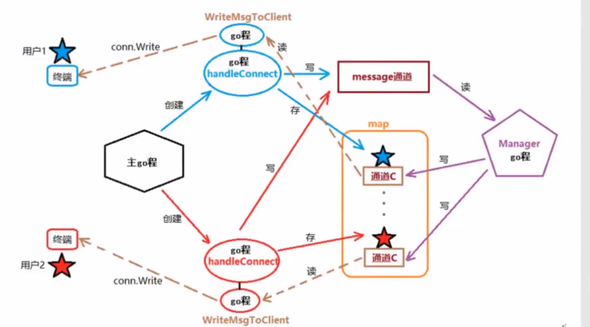

广播用户上线：

    1.主go程中，创建监听套接字，记得defer
    2.for 循环监听客户端连接请求 Accept()
    3.有一个客户端了解，创建新的go程处理客户端数据HandkeConnect()
    4.定义全局结构体类型，定义全局map存储client
    5.创建Manager()  --Accept之前
    6.实现Manager()。初始化在线用户map，循环读取全局channel，如果无数据则阻塞
      如果有数据，遍历在线client map写入client的Channel中
    7.实现HandkeConnect()
        1.获取客户端IP+Port-->RemoteAddr(),初始化新用户结构体信息。注意要初始化
          channel，否则不能用
        2.添加到map中
    8.创建WriteMsgToClient() go程，专门给当前用户写数据 ---来源于当前用户的channel
    9.实现WriteMsgToClient(client,conn)，遍历自带的C，读数据，conn.Write到客户端
    10.HandkeConnect()中，在结束位置，发送用户上线信息（将用户上线信息写到全局channel中）
        --Manager()被激活（原来一直阻塞）  
    11.HandkeConnect()结束位置加一个for，防止终止